# zenpng

[](https://github.com/imazen/zenpng/actions/workflows/ci.yml)
[](LICENSE-AGPL3)
[](https://blog.rust-lang.org/)

PNG encoder and decoder in safe Rust. SIMD-accelerated unfiltering, a progressive
4-phase compression engine with 31 effort levels (and 170 more beyond that), APNG
support, auto-quantization, and full metadata roundtrip.





## Quick start

```rust
use zenpng::{decode, encode_rgba8, EncodeConfig, Compression, PngDecodeConfig};
use enough::Unstoppable;

// Decode
let png_bytes: &[u8] = &[/* ... */];
let output = decode(png_bytes, &PngDecodeConfig::default(), &Unstoppable)?;
println!("{}x{}, alpha={}", output.info.width, output.info.height, output.info.has_alpha);

// Encode at default effort (Balanced, effort 13)
let encoded = encode_rgba8(img.as_ref(), None, &EncodeConfig::default(), &Unstoppable, &Unstoppable)?;

// Encode with a specific preset
let config = EncodeConfig::default().with_compression(Compression::High);
let smaller = encode_rgba8(img.as_ref(), None, &config, &Unstoppable, &Unstoppable)?;
```

Pixel buffers use [`imgref`](https://docs.rs/imgref) + [`rgb`](https://docs.rs/rgb).
Cancellation and deadlines use [`enough::Stop`](https://docs.rs/enough) — pass
`&Unstoppable` when you don't need either.

The encoder automatically optimizes color type and bit depth: RGBA→RGB when
fully opaque, RGB→Grayscale when R==G==B, 16-bit→8-bit when samples fit, and
truecolor→indexed when ≤256 unique colors. All lossless.

## Compression presets

Presets are placed at Pareto-optimal points on the effort curve, approximately
log-spaced in encode time (each step roughly doubles wall time).

| Preset | Effort | What it does |
|---------|--------|-------------|
| `None` | 0 | Uncompressed (stored DEFLATE blocks) |
| `Fastest` | 1 | 1 strategy (Paeth), turbo DEFLATE |
| `Turbo` | 2 | 3 strategies, turbo DEFLATE |
| `Fast` | 7 | 5 strategies, FastHt screen-only |
| `Balanced` | 13 | 9 strategies, screen + lazy refine |
| `Thorough` | 17 | 9 strategies, lazy2 multi-tier + brute-force |
| `High` | 19 | Near-optimal multi-tier + brute-force |
| `Aggressive` | 22 | Near-optimal + extended brute-force |
| `Intense` | 24 | Full brute-force + near-optimal |
| `Crush` | 27 | Full brute-force + beam search + zenzop (requires `zopfli` feature) |
| `Maniac` | 30 | Maximum standard pipeline + zenzop (requires `zopfli` feature) |
| `Brag` | 31 | Full pipeline + 15 FullOptimal iterations — beats ECT-9 |
| `Minutes` | 200 | Full pipeline + 184 FullOptimal iterations |

`Crush`, `Maniac`, and `Brag` fall back to `Intense` if the `zopfli` feature isn't enabled.
`Minutes` runs the full Maniac pipeline plus FullOptimal recompression at
maximum iterations — expect minutes per megapixel.

## Fine-grained effort

For precise control, use `Compression::Effort(n)` with any value from 0 to 200:

```rust
let config = EncodeConfig::default()
    .with_compression(Compression::Effort(17));
```

Effort 0–30 uses zenflate's standard compression pipeline. Effort 31+ adds
FullOptimal recompression with iterative forward-DP parsing — the iteration
count is `effort - 16`, so effort 46 runs 30 iterations, and `Minutes` (effort
200) runs 184 iterations. Higher iterations find better DEFLATE representations
at the cost of time.

With the `zopfli` feature enabled, effort 31+ uses zenzop (an enhanced zopfli
fork with ECT-derived optimizations) instead of zenflate's FullOptimal. On a
13-image test corpus, effort 31 (15 iterations) compresses within 0.11% of
ECT at `-9` (60 zopfli iterations + 8 filter strategies). The corpus is small,
so take that number as a rough indicator rather than a guarantee.

## APNG

```rust
use zenpng::{encode_apng, ApngEncodeConfig, ApngFrameInput};
use enough::Unstoppable;

let frames = vec![
    ApngFrameInput::new(&frame0_rgba, 1, 30),
    ApngFrameInput::new(&frame1_rgba, 1, 30),
];

let config = ApngEncodeConfig::default();
let apng = encode_apng(&frames, width, height, &config, None, &Unstoppable, &Unstoppable)?;
```

All frames are canvas-sized RGBA8. The encoder automatically reduces to RGB
when all frames are fully opaque (25% raw data savings). Delta regions between
consecutive frames are computed automatically, and all 6 dispose/blend
combinations are evaluated per frame (greedy 1-step lookahead) at effort > 2.
Transparent pixel RGB channels are zeroed before compression to improve
DEFLATE performance.

Decoding APNG returns fully composited canvas-sized frames via `decode_apng()`.

## Auto-indexed encoding

When any quantizer feature is enabled (`quantize`, `imagequant`, or `quantette`),
`encode_auto()` quantizes to 256 colors and checks a quality gate before committing
to indexed output:

```rust
use zenpng::{encode_auto, QualityGate, EncodeConfig, default_quantizer};
use enough::Unstoppable;

let quantizer = default_quantizer();
let result = encode_auto(
    img.as_ref(),
    &EncodeConfig::default(),
    &*quantizer,
    QualityGate::MaxDeltaE(0.02),
    None,
    &Unstoppable,
    &Unstoppable,
)?;

// result.indexed: whether palette encoding was used
// result.quality_loss: mean OKLab ΔE (0.0 for truecolor or exact palette)
// result.mpe_score: masked perceptual error (when MaxMpe or MinSsim2 gate used)
// result.ssim2_estimate: estimated SSIMULACRA2 score (when MaxMpe or MinSsim2 gate used)
// result.butteraugli_estimate: estimated butteraugli distance (when MaxMpe or MinSsim2 gate used)
```

If the image has ≤256 unique colors, an exact palette is used with zero quality
loss — no quantization, just a lookup table. Otherwise, zenquant quantizes to
256 colors and the quality gate decides whether the result is acceptable. If
the gate fails, the encoder falls back to lossless truecolor.

Three gate types:

| Gate | Scale | Good default | Meaning |
|------|-------|-------------|---------|
| `MaxDeltaE(f64)` | 0.0 – ∞ | 0.02 | Mean OKLab ΔE (lower = stricter) |
| `MaxMpe(f32)` | 0.0 – ∞ | 0.008 | Masked perceptual error (lower = stricter) |
| `MinSsim2(f32)` | 0 – 100 | 85.0 | Estimated SSIMULACRA2 (higher = stricter) |

`encode_apng_auto()` works the same way but checks the gate per frame and
falls back to truecolor if any frame fails.

## Decode options

```rust
use zenpng::{decode, probe, PngDecodeConfig};
use enough::Unstoppable;

// Probe metadata without decoding pixels
let info = probe(png_bytes)?;

// Default: 100 MP limit, 4 GiB memory limit, checksums skipped
let output = decode(png_bytes, &PngDecodeConfig::default(), &Unstoppable)?;

// No limits, no checksums
let output = decode(png_bytes, &PngDecodeConfig::none(), &Unstoppable)?;

// Verify Adler-32 and CRC-32
let output = decode(png_bytes, &PngDecodeConfig::strict(), &Unstoppable)?;

// Custom
let config = PngDecodeConfig::default()
    .with_max_pixels(1_000_000_000)
    .with_skip_decompression_checksum(false);
```

Checksums are skipped by default for speed. When CRC is skipped, computation
is elided entirely. The decoder handles 8-bit and 16-bit, truecolor and indexed,
interlaced and non-interlaced PNGs.

## Metadata

ICC profiles, EXIF, and XMP are roundtripped through encode/decode. Color space
chunks (gAMA, sRGB, cHRM, cICP) are preserved. Set them on `EncodeConfig`:

```rust
let config = EncodeConfig::default()
    .with_source_gamma(Some(45455))   // 1/2.2
    .with_srgb_intent(Some(0));       // perceptual
```

The decoder warns on conflicting color metadata (e.g., both sRGB and cICP present)
via `PngWarning` variants.

## Feature flags

| Feature | Default | Description |
|---------|---------|-------------|
| `quantize` | yes | Auto-indexed encoding via zenquant (perceptual quality metrics, joint optimization) |
| `imagequant` | no | libimagequant quantizer backend (high-quality dithering) |
| `quantette` | no | quantette quantizer backend (fast k-means, RGB only) |
| `zopfli` | no | Zenzop recompression for Crush/Maniac and effort 31+ (enhanced zopfli fork) |
| `joint` | no | Joint quantization (requires `quantize`) |
| `zencodec` | no | zencodec trait integration |

## Performance

The decoder uses SIMD-accelerated PNG unfiltering via archmage dispatch:

- **Paeth filter**: 1.6x (RGB) to 2.1x (RGBA) speedup over scalar, branchless i16 predictor (SSE4.2)
- **Sub filter**: ~1.2x on RGBA (SSE2); marginal on RGB due to sequential dependency
- **Up/Average**: LLVM auto-vectorizes scalar to equivalent performance

Dispatch is per-row via `incant!` — no per-pixel overhead. The full decode path
uses ~7 heap allocations total and zenflate decompression accounts for only 0.5%
of instructions (the rest is unfiltering and pixel output).

The encoder's 4-phase pipeline (screen → refine → brute-force → recompress)
automatically adjusts to the effort level. See the effort curve chart above
for the compression-vs-time tradeoff across all 31 standard effort levels.

## MSRV

The minimum supported Rust version is **1.93**.

## AI-Generated Code Notice

Developed with Claude (Anthropic). Not all code manually reviewed. Review critical paths before production use.

## License

Dual-licensed: [AGPL-3.0](LICENSE-AGPL3) or [commercial](LICENSE-COMMERCIAL).

I've maintained and developed open-source image server software — and the 40+
library ecosystem it depends on — full-time since 2011. Fifteen years of
continual maintenance, backwards compatibility, support, and the (very rare)
security patch. That kind of stability requires sustainable funding, and
dual-licensing is how we make it work without venture capital or rug-pulls.
Support sustainable and secure software; swap patch tuesday for patch leap-year.

[Our open-source products](https://www.imazen.io/open-source)

**Your options:**

- **Startup license** — $1 if your company has under $1M revenue and fewer
  than 5 employees. [Get a key →](https://www.imazen.io/pricing)
- **Commercial subscription** — Governed by the Imazen Site-wide Subscription
  License v1.1 or later. Apache 2.0-like terms, no source-sharing requirement.
  Sliding scale by company size.
  [Pricing & 60-day free trial →](https://www.imazen.io/pricing)
- **AGPL v3** — Free and open. Share your source if you distribute.

See [LICENSE-COMMERCIAL](LICENSE-COMMERCIAL) for details.
